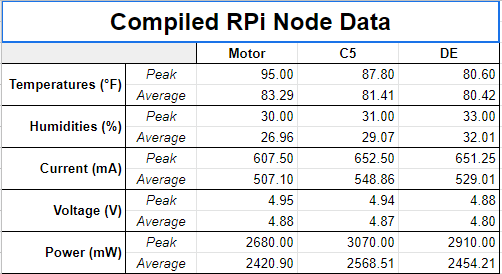

# Software-Defined Wireless Sensor Network 
 by Benson Thong, Edgar Silerio, Jeffrey Spaulding, Erick Rodriguez

# Project Description
This course project is based on the Senior Design Project under the guidance of Tamer Omar at Cal Poly Pomona. The project demonstrates the topic of Software Defined Networks, what it encompasses in research, and how it can be used to solve issues of traditional networks. In addition, the project utilizes the usage of Linux distributions (Ubuntu 20.04 Desktop, Server and Raspbian OS) as well as Linux commands in the terminal to set up wireless access points and installation of packages necessary to make this project work.

<br/> The project utilizes a bare-metal server(VMware esxi) and OpenFlow switches(Cisco catalyst 2960-X Series) to generate the software-defined network. The server is connected to CPP's VPN. A software based controller is installed on a virtual machine where an application interface called the Flow Manager developed by Maen Artimy. The project consist of 3 access points by configuring the Raspberry Pi to serve as a hotspot. Raspberry Pi that act as a sensor node are then connected to its respective access point. Because each sensor node is connected to a different access point, connectivity isn't possible among the three sensor nodes displayed in the diagram. This is where software-defined network plays a role to allow connection. Compared to traditional networks, manual configurations on each access point is done one-by-one. A software-defined network controls this using a software controller to centralize the system and controlling the network through a single entity. With the generation of flows in the OpenFlow  switch, an instruction is sent to the flow table of the switch to perform an action of outputting a packet to a destination port, if the flow is matched with an incoming packets on an ingress port of the switch. After connection among two ports, Muon(a software SFTP and SSH terminal emulator application) is used for data transfer.</br> 

## Future Work
<br/> Challenges faced: Troubleshooting server and switches took up the majority time in the project. The project started off with a complex design which can be found in ```pictures/Design1.png``` which utilizes multiple OpenFlow switches with two selective paths to traverse incoming packets between the two ports. Unfortunately, the issue lies in the complexity of creating a set of flows for multiple switches which was not possible for the Flow Manager used. The automative process inherited on the following algorithm located in ```pictures/Algorithm.PNG``` was created to serve as a build and destroy algorithm of flows. An automation process of flows were in the process of making using Python, however, was incomplete due to the lack of time.

# System Diagram

<br/> This diagram provides a view of how the project structures and what ports were used in the switch to provide a sense of how software-defined networks is used. With the sense of virtualization, the project can be done remotely via SSH using Cal Poly Pomona's VPN using GlobalProtect services.

# Sensor Node 

<br/> In the following picture shows the following hardware used to build the sensor node using the Raspberry Pi 3b+:
- Adafruit's INA260 power sensor 
- DHT11 temperature and humidity sensor
- Micro-USB breakout board
- A specific LED to differentiate among the different sensor nodes 
</br>

## Software
- ```WSN/sensor.py``` utilizes libraries by Adafruit to grab sensor data from the temperature/humidity as well as current, voltage, and power from the power sensor. 
- ```WSN/main.py``` is the main python file ran to gather all sensor data and import it into a CSV file.
- ```WSN/Node.py``` is the power consumption algorithm that determines the node path with the least amount of power consumption by taking the average power of 3 CSV files generated from data transfer using Muon. 
# Ryu Controller Topology

<br/> As shown in the Flow Manager, displays all the Raspberry Pi's MAC address. This is to ensure that the sensor nodes and access points are connected to the network. In addition the port numbers of the OpenFlow switch on the flow manager are represented in hexadecimal. 

# Generation of flows

<br/> The generation of flows allows ports to receive and match incoming packets. Compared to a regular switch, an OpenFlow switch has a flowtable to store all the flows. Flows is essentially a network packet rule that is transmitted from an OpenFlow controller to an OpenFlow switch. With flows, it can do a myriad of actions such as OUTPUT action which traverses packets back and forth from a source port and destination port. This is shown from the diagram where two ports OUTPUT back to each other to establish connectivity between to sensor nodes to traverse sensor data back and forth. Flows contain a priority such that the highest priority will match incoming packets, whereas the low priorities are ignored and will be dropped by the controller.

# Data Collection

<br/> Data was compiled in google spreadsheet to see which path has the lowest power consumption based on the System Diagram. 

### Contributions 
Derek Mata and Christopher Yamada for the installation of power sensor nodes as well as temperature/humidity sensor code. 
