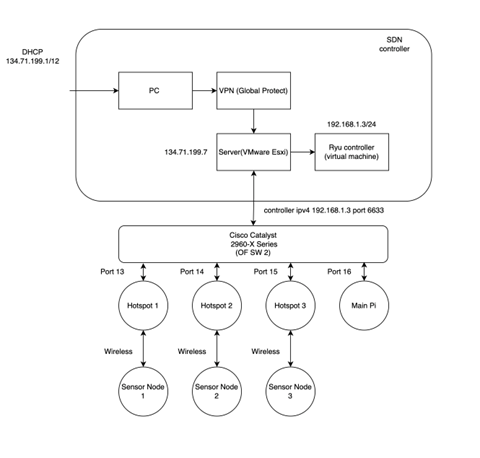

# Software-Defined Wireless Sensor Network 
 by Benson Thong, Edgar Silerio, Jeffrey Spaulding, Erick Rodriguez

# Project Description
This course project is based on the Senior Design Project under the guidance of Tamer Omar at Cal Poly Pomona. The project demonstrates the topic of Software Defined Networks, what it encompasses in research, and how it can be used to solve issues of traditional networks. 

  The project utilizes a bare-metal server(VMware esxi) and OpenFlow switches(Cisco catalyst 2960-X Series) to generate the software-defined network. The server is connected to CPP's VPN which can be accessed from an IP address. A software based controller is installed on a virtual machine where an application interface called the Flow Manager developed by Maen Artimy. The project consist of 3 access points by configuring the Raspberry Pi to serve as a hotspot. Raspberry Pi that act as a sensor node are then connected to its respective access point. Because each sensor node is connected to a different access point, connectivity isn't possible among the three sensor nodes displayed in the diagram. This is where software-defined network plays a role to allow connection. Compared to traditional networks, manual configurations on each access point is done one-by-one. A software-defined network controls this using a software controller to centralize the system and controlling the network through a single entity. With the generation of flows in the OpenFlow  switch, an instruction is sent to the flow table of the switch to perform an action of outputting a packet to a destination port, if the flow is matched with an incoming packets on an ingress port of the switch.  

# System Diagram

  This diagram provides a view of how the project structures and what ports were used in the switch to provide a sensor of how software-defined networks is used. With the sense of virtualization, the project can be done remotely via SSH using Cal Poly Pomona's VPN using GlobalProtect services.

# Sensor Node 

  In the following picture shows the following hardware used to build the sensor node using the Raspberry Pi 3b+:
- Adafruit's INA260 power sensor 
- DHT11 temperature and humidity sensor
- Micro-USB breakout board
- A specific LED to differentiate among the different sensor nodes 
 

# Ryu Controller Topology

  As shown in the Flow Manager, displays all the Raspberry Pi's MAC address. This is to ensure that the sensor nodes and access points are connected to the network. 

# Generation of flows

### Contributions 
Derek Mata and Christopher Yamada for the installation of power sensor nodes as well as temperature/humidity sensor code. 
